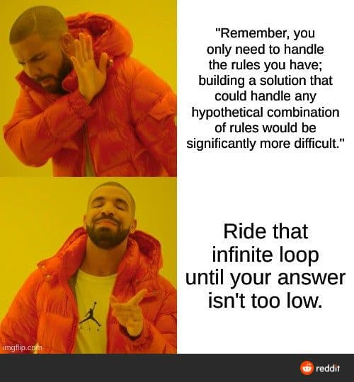
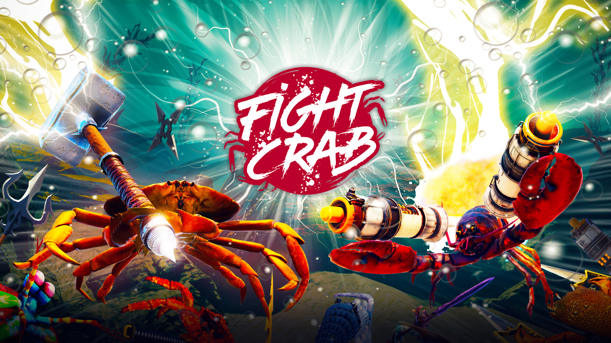

# Kotlin Examples

[Learn Kotlin by example](https://play.kotlinlang.org/byExample/overview?_ga=2.185933865.1666331684.1604597595-1007222991.1603743628)

## 🎄 AoC 2020 🎅
- [Day 1](https://adventofcode.com/2020/day/1) (Report Repair): [code](src/main/kotlin/adventOfCode2020/day1/Day1.kt) - [tests](src/test/kotlin/adventOfCode2020/day1/Day1KtTest.kt)
- [Day 2](https://adventofcode.com/2020/day/2) (Password Philosophy): [code](src/main/kotlin/adventOfCode2020/day2/Day2.kt) - [tests](src/test/kotlin/adventOfCode2020/day2/Day2KtTest.kt)
- [Day 3](https://adventofcode.com/2020/day/3) (Toboggan Trajectory): [code](src/main/kotlin/adventOfCode2020/day3/Day3.kt) - [tests](src/test/kotlin/adventOfCode2020/day3/Day3KtTest.kt)
- [Day 4](https://adventofcode.com/2020/day/4) (Passport Processing): [code](src/main/kotlin/adventOfCode2020/day4/Day4.kt) - [tests](src/test/kotlin/adventOfCode2020/day4/Day4KtTest.kt)
- [Day 5](https://adventofcode.com/2020/day/5) (Binary Boarding): [code](src/main/kotlin/adventOfCode2020/day5/Day5.kt) - [tests](src/test/kotlin/adventOfCode2020/day5/Day5KtTest.kt) - [seat map](src/main/kotlin/adventOfCode2020/day5/seatMap)
- [Day 6](https://adventofcode.com/2020/day/6) (Custom Customs): [code](src/main/kotlin/adventOfCode2020/day6/Day6.kt) - [tests](src/test/kotlin/adventOfCode2020/day6/Day6KtTest.kt)
- [Day 7](https://adventofcode.com/2020/day/7) (Handy Haversacks, a.k.a. A bag in a bag in a bag...): [code](src/main/kotlin/adventOfCode2020/day7/Day7.kt) - [tests](src/test/kotlin/adventOfCode2020/day7/Day7KtTest.kt) - visualisation: 
- [Day 8](https://adventofcode.com/2020/day/8) (Handheld Halting): [code](src/main/kotlin/adventOfCode2020/day8/Day8.kt) - [tests](src/test/kotlin/adventOfCode2020/day8/Day8KtTest.kt)   
- [Day 9](https://adventofcode.com/2020/day/9) (Encoding Error): [code](src/main/kotlin/adventOfCode2020/day9/Day9.kt) - [tests](src/test/kotlin/adventOfCode2020/day9/Day9KtTest.kt)   
- [Day 10](https://adventofcode.com/2020/day/10) (Adapter Array, a.k.a. Don't do this on a plane): [code](src/main/kotlin/adventOfCode2020/day10/Day10.kt) - [tests](src/test/kotlin/adventOfCode2020/day10/Day10KtTest.kt) - visual:  
- [Day 11](https://adventofcode.com/2020/day/11) (Seating System): [code](src/main/kotlin/adventOfCode2020/day11/Day11.kt) - [tests](src/test/kotlin/adventOfCode2020/day11/Day11KtTest.kt) 
- [Day 12](https://adventofcode.com/2020/day/12) (Rain Risk): [code](src/main/kotlin/adventOfCode2020/day12/Day12.kt) - [tests](src/test/kotlin/adventOfCode2020/day12/Day12KtTest.kt) 
- [Day 13](https://adventofcode.com/2020/day/13) (Shuttle Search): [code](src/main/kotlin/adventOfCode2020/day13/Day13.kt) - [tests](src/test/kotlin/adventOfCode2020/day13/Day13KtTest.kt) 
- [Day 14](https://adventofcode.com/2020/day/14) (Docking Data): [code](src/main/kotlin/adventOfCode2020/day14/Day14.kt) - [tests](src/test/kotlin/adventOfCode2020/day14/Day14KtTest.kt) 
- [Day 15](https://adventofcode.com/2020/day/15) (Rambunctious Recitation): [code](src/main/kotlin/adventOfCode2020/day15/Day15.kt) - [tests](src/test/kotlin/adventOfCode2020/day15/Day15KtTest.kt) 
- [Day 16](https://adventofcode.com/2020/day/16) (Ticket Translation): [code](src/main/kotlin/adventOfCode2020/day16/Day16.kt) - [tests](src/test/kotlin/adventOfCode2020/day16/Day16KtTest.kt)
- [Day 17](https://adventofcode.com/2020/day/17) (Conway Cubes, a.k.a. Now I know how Cooper must have felt in Interstellar): [code](src/main/kotlin/adventOfCode2020/day17/Day17.kt) - [tests](src/test/kotlin/adventOfCode2020/day17/Day17KtTest.kt) 
- [Day 18](https://adventofcode.com/2020/day/18) (Operation Order): [code](src/main/kotlin/adventOfCode2020/day18/Day18.kt) - [tests](src/test/kotlin/adventOfCode2020/day18/Day18KtTest.kt)
- [Day 19](https://adventofcode.com/2020/day/19) (Monster Message): [code](src/main/kotlin/adventOfCode2020/day19/Day19.kt) - [tests](src/test/kotlin/adventOfCode2020/day19/Day19KtTest.kt) - [final regex (scary)](src/main/kotlin/adventOfCode2020/day19/final_regex) - visualisation: 
- [Day 20](https://adventofcode.com/2020/day/20) (Jurassic Jigsaw): [code](src/main/kotlin/adventOfCode2020/day20/Day20.kt) - [tests](src/test/kotlin/adventOfCode2020/day20/Day20KtTest.kt) - [visualisation](https://refined-github-html-preview.kidonng.workers.dev/martapanc/kotlin-koans/raw/master/src/main/kotlin/adventOfCode2020/day20/render/sea.html)
- [Day 21](https://adventofcode.com/2020/day/21) (Allergen Assessment): [code](src/main/kotlin/adventOfCode2020/day21/Day21.kt) - [tests](src/test/kotlin/adventOfCode2020/day21/Day21KtTest.kt)
- [Day 22](https://adventofcode.com/2020/day/22) (Crab Combat): [code](src/main/kotlin/adventOfCode2020/day22/Day22.kt) - [tests](src/test/kotlin/adventOfCode2020/day22/Day22KtTest.kt) - visualisation: 
- [Day 23](https://adventofcode.com/2020/day/23)
- [Day 24](https://adventofcode.com/2020/day/24)
- [Day 25](https://adventofcode.com/2020/day/25)
